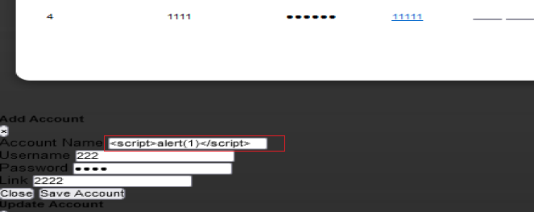
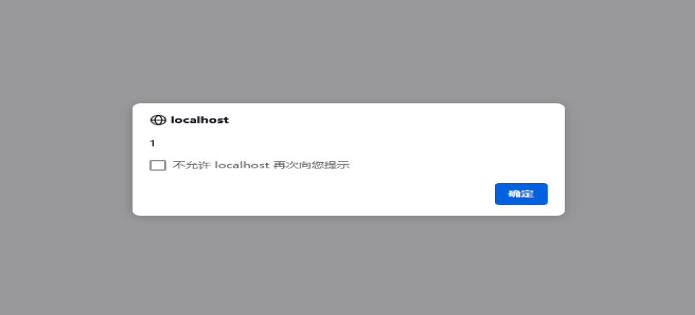

# Accounts Manager App
#Accounts Manager App Stored Cross-Site Scripting(XSS)
#Description
The system Client doesn't properly sanitise POST parameter, which result into a Stored Cross-Site Scripting(XSS).
#Vendor Homepage
[https://www.sourcecodester.com/php/17482/accounts-manager-app-using-php-and-mysql-source-code.html](https://www.sourcecodester.com/php/17482/accounts-manager-app-using-php-and-mysql-source-code.html)
#Author
[lsi.webray.com.cn](https://github.com/lscjl/lsi.webray.com.cn) inc
#Proof of Concept

1\. Open the /account-manager-app/index.php page and click Save Account to add a payload to the Save Account

2\. Accessing /account-manager-app/index.php again will trigger the code:

