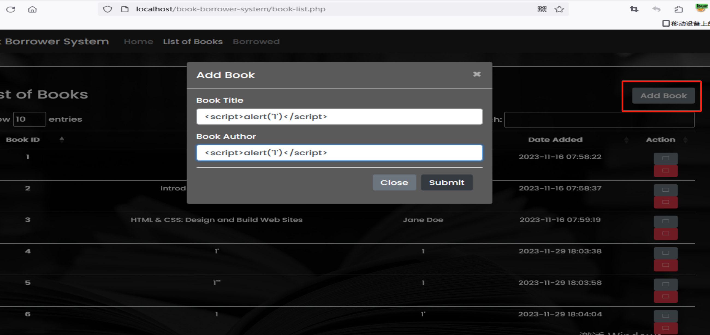
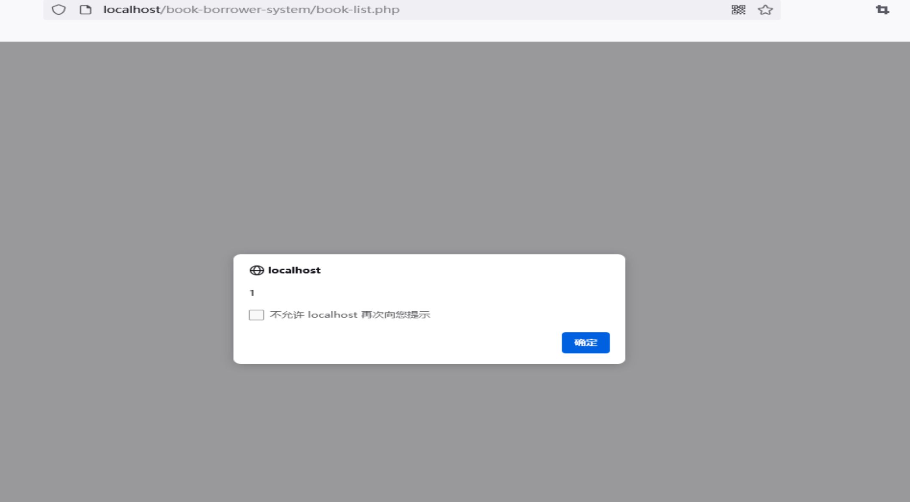

# Book Borrower System Cross site scripting
#Book Borrower System Stored Cross-Site Scripting(XSS)
#Description
The system Client doesn't properly sanitise POST parameter, which result into a Stored Cross-Site Scripting(XSS).
#Vendor Homepage
[https://www.sourcecodester.com/php/16993/book-borrower-system-using-php-source-code.html](https://www.sourcecodester.com/php/16993/book-borrower-system-using-php-source-code.html#google_vignette)
#Author
[lisi@webray.com.cn](https://github.com/lscjl/lsi.webray.com.cn) inc
#Proof of Concept

1\. Open the/book browser system/book list. php page and click ADD BOOK to add a payload to the Book Title or Book Author:

2\. Accessing/book browser system/book list. php again will trigger the code:

