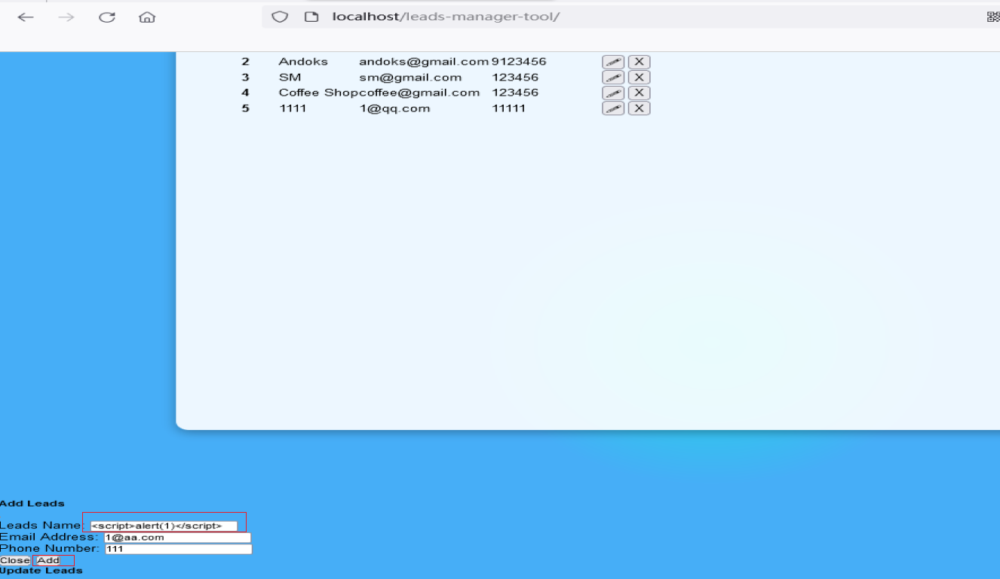
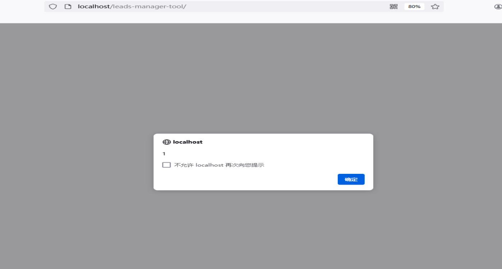

# Leads Manager Tool Cross site scripting
#Leads Manager Tool Stored Cross-Site Scripting(XSS)
#Description
The system Client doesn't properly sanitise POST parameter, which result into a Stored Cross-Site Scripting(XSS).
#Vendor Homepage
[https://www.sourcecodester.com/php/16993/book-borrower-system-using-php-source-code.html](https://www.sourcecodester.com/php/16993/book-borrower-system-using-php-source-code.html#google_vignette)
#Author
[lsi.webray.com.cn](https://github.com/lscjl/lsi.webray.com.cn) inc
#Proof of Concept

1\. Open the /leads-manager-tool/ page and click Add Leads to add a payload to the Add Leads:

2\. Accessing /leads-manager-tool/ again will trigger the code:

