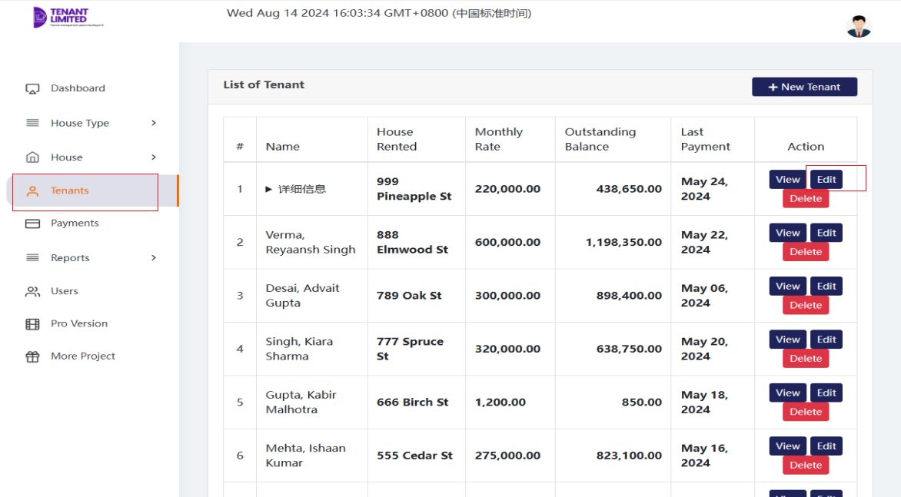
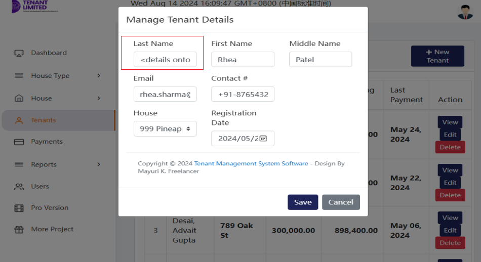
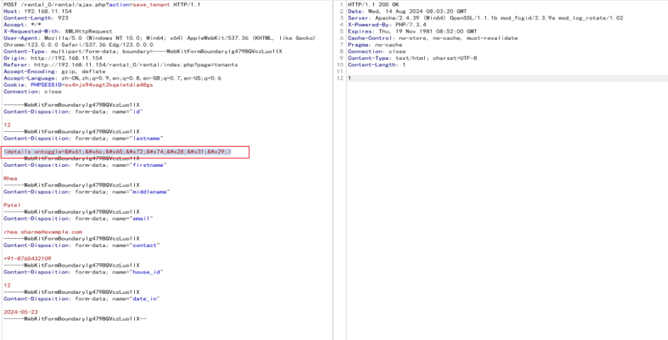
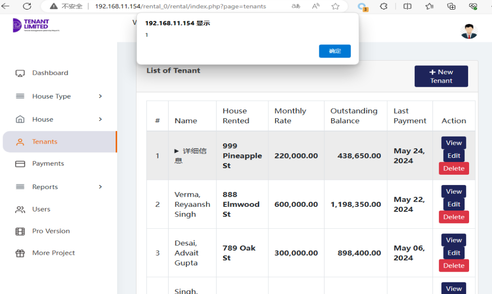

# rental management system Stored Cross-Site Scripting(XSS)
#Accounts Manager App Stored Cross-Site Scripting(XSS)
#Description
The system Client doesn't properly sanitise POST parameter, which result into a Stored Cross-Site Scripting(XSS).
#Vendor Homepage

[https://www.sourcecodester.com/php/17375/best-courier-management-system-project-php.html](https://www.sourcecodester.com/php/17375/best-courier-management-system-project-php.html)
#Author
[lsi.webray.com.cn](https://github.com/lscjl/lsi.webray.com.cn) inc
#Proof of Concept

1.In /rental\_0/rental/ajax.php?action=save\_tenant Insert payload at the lastname parameter

2.Refresh the page, click on the details tab, and the inserted XSS code will be executed

